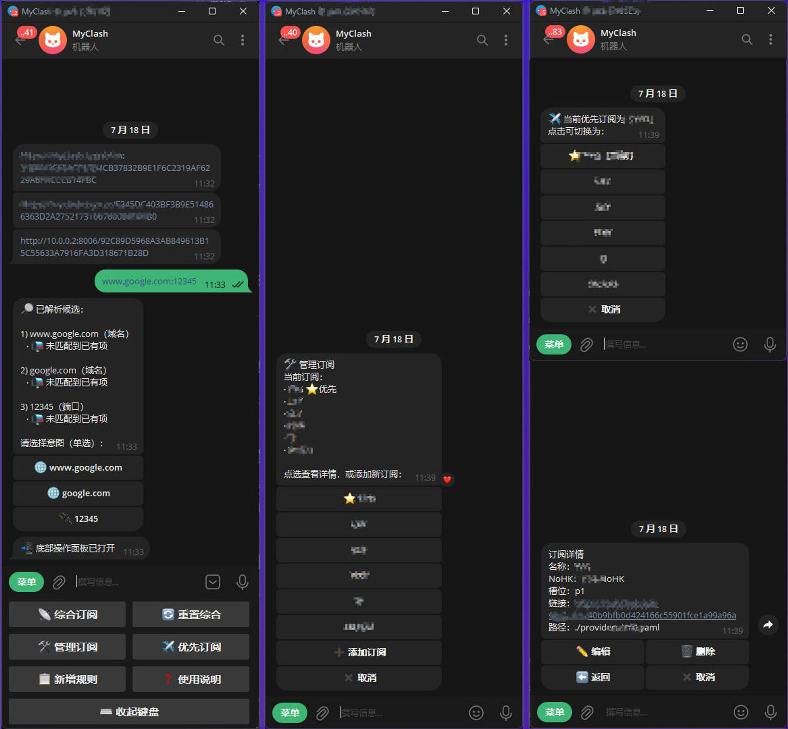

# 感谢
**Mihomo & OpenClash**
- [MetaCubeX/mihomo](https://github.com/MetaCubeX/mihomo)
- [vernesong/OpenClash](https://github.com/vernesong/OpenClash)

**YAML 配置参考**
- [666OS/YYDS](https://github.com/666OS/YYDS)
- [Aethersailor/Custom_OpenClash_Rules](https://github.com/Aethersailor/Custom_OpenClash_Rules)

# MyClash
## 基于 Telegram Bot 交互的 OpenClash YAML 配置文件管理工具。
- 多源订阅聚合与管理；
- clash分流规则、fakeip豁免规则增删；
- 综合订阅链接下发；
- 把日常改配置、管订阅收进telegram交互。

## 写在前面
作者是业余人员，不会写代码，项目全靠 Cursor 开发，后续也不一定续费，精力有限，
本项目主要是抛砖引玉，以及个人自用，所以：
- 功能类需求、改造建议请自行 **Fork**，本仓库暂不扩展功能；
- 欢迎提交**明显 Bug** 的修复 PR；提 PR 时尽量按下面格式说明，方便核对：
```markdown
## 问题截图
（Telegram / 日志，能看清现象即可）
## 复现步骤
1. …
2. …
## 修复说明
- 原因：…
- 改动：…
## 校验通过
- [ ] 已按步骤自测，问题消失
- [ ] 仅修 Bug，未改功能行为
```


## 功能概览
通过 Telegram 底部面板（`/panel`）完成日常操作，主要能力如下。
### 订阅管理
- 添加、查看、编辑、删除订阅源
- 切换**优先订阅**（永不失联策略优先使用哪一路）
- 订阅以短名展示与管理，不依赖槽位编号记忆
### 规则编辑
- 聊天里直接粘贴域名、IP、URL 或端口
- 自动解析候选（主机 / 父域 / 端口等），单选写入
- 支持直连、代理、嗅探、真实 IP 等常见规则类型
### 综合订阅
- 将当前完整配置以订阅链接形式下发，客户端可直接订阅
- 支持多个对外域名同时生成链接
- 重置综合可作废旧链接并换发新路径，降低泄露风险
### 备份恢复
- 手动备份 / 定时备份（默认每 7 天 02:00）
- 列表查看、恢复、删除；总数上限默认 10，超出自动删最旧
### 快捷方式
- 底部键盘：综合订阅、重置综合、管理订阅、优先订阅、新增规则、备份恢复、使用说明
- 命令：`/panel` `/prior` `/subs` `/links` `/renew` `/backup` `/guide`
### 截图


## 快速开始
从 GitHub Container Registry 拉取镜像（`ghcr.io`，不是 Docker Hub）：
```bash
mkdir myclash && cd myclash
curl -fsSL -o compose.yml https://raw.githubusercontent.com/shengshk/MyClash/main/compose.example.yml
mkdir -p data
curl -fsSL -o data/aio.yaml https://raw.githubusercontent.com/shengshk/MyClash/main/data/aio.example.yaml
# 编辑 compose.yml：TGBOT、DOMAIN*
# 编辑 data/aio.yaml：secret、订阅 URL、登记短名
docker compose pull
docker compose up -d
```
镜像：`ghcr.io/shengshk/myclash:latest`。私有包若拉不下，先 `docker login ghcr.io`。
本地改源码时，在 compose 里改用 `build: ./app`，然后 `docker compose up -d --build`。
对 bot 发 `/panel` 打开底部键盘。
### 环境变量
| 变量                    | 说明                                                |
| --------------------- | ------------------------------------------------- |
| `TGBOT`               | `bot_token,user_id[,…]`（写在 compose `environment`） |
| `YAML_PATH`           | 默认 `/data/aio.yaml`                               |
| `DOMAIN` / `DOMAIN1`… | 综合订阅基址，勿带 path                                    |
| `SUB_LISTEN`          | 默认 `:8006`                                        |
| `TG_PROXY_URL`        | 可选，访问 Telegram API 的代理                            |
| `BACKUP_MAX`          | 备份总数上限，默认 `10`                                     |
| `BACKUP_CRON`         | 定时备份，默认 `0 2 */7 * *`（每 7 天 02:00，复用 `TZ`）         |

## 目录
```
app/                 Go bot + 订阅 HTTP
docs/                截图等
LICENSE              MIT
compose.example.yml
data/aio.example.yaml
```

## 风险提示 / 免责声明
1. 本项目仅供学习、研究与个人配置管理使用；作者不对合法性、准确性、完整性或有效性作任何保证，请自行判断并遵守所在地法律法规。
2. 下载、使用、修改或传播本项目的任何内容，即视为已阅读并接受本声明；因使用本项目引起的任何直接或间接后果（含隐私泄露、数据损失、法律纠纷等），均由使用者自行承担，与作者无关。
3. 禁止将本项目用于任何违法、侵权或未经授权的商业用途；若因此产生责任，由行为人自行承担。
4. 本项目不提供任何代理节点、订阅服务或翻墙能力，示例配置中的占位内容须由使用者自行替换为合法来源。
5. 作者保留随时修改或补充本声明的权利，恕不另行通知。

## License
[MIT](LICENSE)